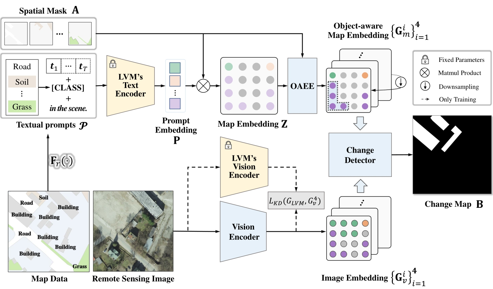
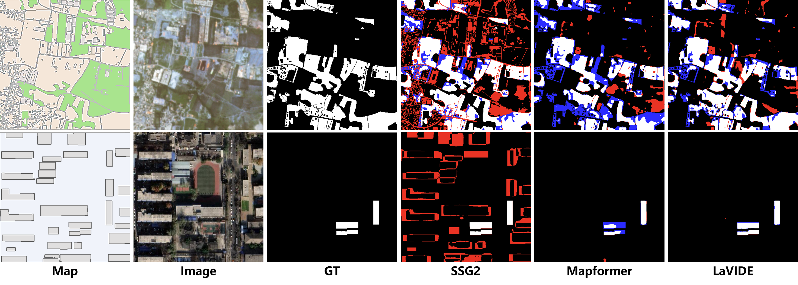

# LaVIDE: Language-Prompted Satellite Change Detection via Map-Image Alignment
<div align="center">

<!-- <a href="https://arxiv.org/abs/2602.01296"></a>&ensp;<a href="https://calmke.github.io/LiPMAP/"></a> -->

[Shuguo Jiang]()<sup>1</sup>,[Fang Xu]()<sup>2</sup>,[Chuandong Liu]()<sup>1</sup>,[Hong Tan]()<sup>3,4</sup>,[Shengyang Li]()<sup>3,4</sup>,[Lei Yu]()<sup>2</sup>,[Wen Yang]()<sup>5</sup>,[Sen Jia]()<sup>6</sup>,[Gui-Song Xia]()<sup>2</sup>

<sup>1</sup>School of Computer Science, Wuhan University &ensp;&ensp;<sup>2</sup>School of Artificial Intelligence, Wuhan University &ensp;&ensp; <sup>3</sup>Technology and Engineering Center for Space Utilization, Chinese Academy of Science &ensp;&ensp; <sup>4</sup>Key Laboratory of Space Utilization, Chinese Academy of Science &ensp;&ensp; <sup>5</sup>School of Electronic Information, Wuhan University &ensp;&ensp; <sup>6</sup>College of Computer Science and Software Engineering, Shenzhen University

</div>

<!--  -->



## 📖 Overview
Remote sensing change detection based on a map reference and an up-to-date image boosts timely observation of the Earth's surface when earlier images are lacking for comparison. However, the semantic gap between high-level map categories and low-level image details hinders the extraction of homogeneous features for robust temporal association in change detection.
Unlike conventional approaches that either compare pixel-level visual similarity or propagate segmentation errors, we propose LaVIDE, a novel language-vision discriminator that bridges the semantic gap between high-level map categories and low-level image details by leveraging language as an intermediary. Specifically, we introduce {\it restricted prompt learning} to generate context-aware textual prompts that align map semantics with image content, and an {\it object-aware embedding enhancement} strategy to integrate object-level attributes (e.g., shape, boundary) into map representations. These components enable robust cross-modal alignment within a unified language-vision feature space. Extensive experiments on four benchmarks—DynamicEarthNet, HRSCD, BANDON, and SECOND—demonstrate that LaVIDE outperforms state-of-the-art methods by significant margins, achieving $18.4\%$ and $5.2\%$ improvements in IoU on multi-class and single-class change detection tasks, respectively. Our framework not only advances the accuracy of map-image change detection but also provides a practical solution for rapid map updating with minimal human intervention, promising broad impacts in urban planning, disaster assessment, and ecological conservation.

## ⚙️ Requirements
* Python >= 3.9
* See `requirements.txt`


## 📊 Data Preparation
We provide all scripts for pre-processing on DynamicEarthNet, HRSCD, BANDON, and SECOND.
Please download and place all datasets in the `./data` folder.

* DynamicEarthNet 
```
python tools/convert_datasets/create_dynearthnet_tiles.py --data_dir ./data/DynamicEarthNet --out_dir ./data/DynamicEarthNet/tile512 --tile_size 512
```

* HRSCD 
```
python tools/convert_datasets/create_hrscd_tiles.py --data_dir ./data/HRSCD --out_dir ./data/HRSCD/tile512 --tile_size 512
```

* BANDON 
```
python tools/convert_datasets/create_bandon_tiles.py --data_dir ./data/BANDON --out_dir ./data/BANDON/tile512 --tile_size 512
```

* SECOND 
```
python tools/convert_datasets/create_second_tiles.py --data_dir ./data/SECOND --out_dir ./data/SECOND/tile512 --tile_size 512
```


## 🚗🔥Runing
* Training
```
python ./tools/train.py configs/cross_modal_bcd/dynamicearthnet/lavide.yaml --work-dir runs/cross_modal_bcd/dynamicearthnet/lavide
```
* Testing
```
python tools/test.py configs/cross_modal_bcd/dynamicearthnet/lavide.yaml --checkpoint ./path/to/checkpoint.pth --eval BC BC_precision BC_recall SC SCS mIoU --samples-per-gpu=1
```

## 🔍 Visualization 
<div aligh=center witdh="200"></div>


## 🙏 Acknowledgements
LiPMAP is built on the top of several outstanding open-source projects. We are extremely grateful for the contributions of these projects and their communities, whose hard work has greatly propelled the development of the field and enabled our work to be realized.
- [Mapformer](https://github.com/mxbh/mapformer)
- [MMSegmentation](https://github.com/open-mmlab/mmsegmentation)
